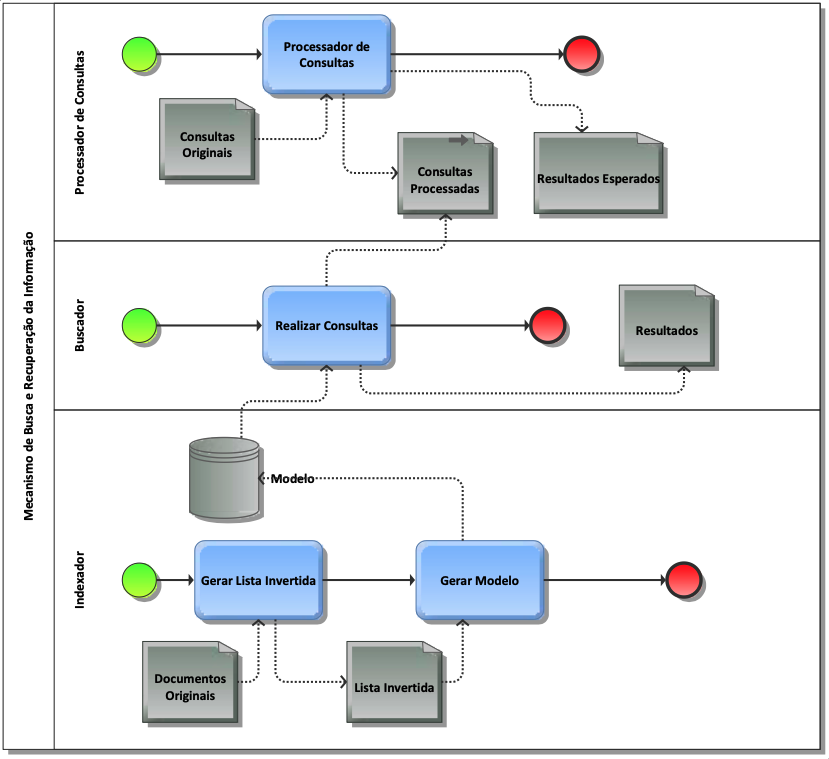

# Implementação de um sistema de recuperação em memória segundo o modelo vetorial

**Descrição:**  Esse exercício está dimensionado para ser feito em Python com a biblioteca NLTK. Você pode escolher outra linguagem por sua conta e risco.
O exercício usará a base CysticFibrosis2, disponível no Moodle.
Você deve fazer um sistema de recuperação da informação divido em módulos especificados a seguir. O sistema poderá funcionar totalmente me memória, usando arquivos para comunicação entre módulos.

Os módulos devem, em geral, seguir o princípio de processamento em batch:

1. Ler todos os dados
2. Fazer todo o processamento
3. Salvar todos os dados

Alguns desses módulos podem ser reusados ou refeitos em exercícios posteriores.
Todos os módulos deve possuir um LOG que permitam pelo menos a um programa posterior, usando o módulo logging de Python:

1. Identificar quando iniciaram suas operações
2. Identificar quando iniciam cada parte de seu processamento
    - Ler arquivo de configuração
    - Ler arquivo de dados

3. Identificar quantos dados foram lidos
4. Identificar quando terminaram os processamentos
5. Calcular os tempos médios de processamento de consultas, documento e palavras, de acordo com o programa sendo usado
6. Identificar erros no processamento, caso aconteçam

O modelo do sistema a ser implementado é o seguinte:

## Processador de consultas

O objetivo desse módulo é transformar o arquivo de consultas fornecido ao padrão de palavras que estamos utilizando.
1. O Processador de Consultas deverá ler um arquivo de configuração
    - O arquivo é criado por vocês
    - O nome do arquivo é [PC.CFG](./src/config/pc.cfg)
    - Ele contém dois tipos de instruções
        1. LEIA=\<nome de arquivo\>
        2. CONSULTAS=\<nome de arquivo\>
        3. ESPERADOS=\<nome de arquivo\>
        4. As instruções são obrigatórias, aparecem uma única vez e nessa ordem.
 
2. O Processador de Consultas deverá ler um arquivo em formato XML
    - O arquivo a ser lido será indicado pela instrução LEIA no arquivo de configuração
        1. O formato é descrito pelo arquivo “cfc2-query.dtd”.
        2. O arquivo a ser lido é “cfquery.xml”.

3. O Processador de Consultas deverá gerar dois arquivos
    - Os arquivos deverão ser no formato cvs
        1. O caractere de separação será o “;”, ponto e vírgula
            - Todos os caracteres “;” que aparecerem no arquivo original devem ser eliminados
        2. A primeira linha do arquivo cvs deve ser o cabeçalho com o nome dos campos
    - O primeiro arquivo a ser gerado será indicado na instrução CONSULTAS do arquivo de configuração
        1. Cada linha representará uma consulta
            - O primeiro campo de cada linha conterá o número da consulta
                a. Campo QueryNumber
            - O segundo campo de cada linha conterá uma consulta processada em letras maiúsculas, sem acento
                - A partir do campo QueryText
            - Cada aluno poderá escolher como criar sua consulta
    - O segundo arquivo a ser gerado será indicado na instrução ESPERADOS
        1. Cada linha representará uma consulta
            - O primeiro campo de cada linha conterá o número da consulta
                - Campo QueryNumber
            - O segundo campo conterá um documento
                - Campo DocNumber
            - O terceiro campo conterá o número de votos do documento
                - Campo DocVotes
            - Uma consulta poderá aparecer em várias linhas, pois podem possuir vários documentos como resposta
            - As linhas de uma consulta devem ser consecutivas no arquivo
            - Essas contas devem ser feitas a partir dos campos Records, Item e do atributo Score de Item
                - Considerar qualquer coisa diferente de zero como um voto

## Gerador de lista invertida

A função desse módulo é criar as listas invertidas simples.

1. O Gerador Lista Invertida deverá ler um arquivo de configuração
    - O nome do arquivo é [GLI.CFG](./src/config/gli.cfg)
    - Ele contém dois tipos de instruções
        - LEIA=\<nome de arquivo\>
        - ESCREVA=\<nome de arquivo\>
        - Podem ser uma ou mais instruções LEIA
        - Deve haver uma e apenas uma instrução ESCREVA
        - A instrução ESCREVA aparece depois de todas as instruções LEIA

2. Invertida deverá ler um conjunto de arquivos em formato XML
    - Os arquivos a serem lidos serão indicados pela instrução LEIA no arquivo de configuração
    - O formato é descrito pelo arquivo cfc2.dtd.
    - O conjunto de arquivos será definido por um arquivo de configuração
    - Os arquivos a serem lidos são os fornecidos na coleção

3. Só serão usados os campos RECORDNUM, que contém identificador do texto e ABSTRACT, que contém o texto a ser classificado
    - Atenção: Se o registro não contiver o campo ABSTRACT deverá ser usado o campo EXTRACT 
    
4. O Gerador Lista Invertida deverá gerar um arquivo
    - O arquivo a ser gerado será indicado na instrução ESCREVA do arquivo de configuração
    - O arquivo deverá ser no formato cvs
        - O caractere de separação será o “;”, ponto e vírgula c. Cada linha representará uma palavra
    - O primeiro campo de cada linha conterá a palavra em letras maiúsculas, sem acento
    - O segundo campo de cada linha apresentará uma lista (Python) de identificadores de documentos onde a palavra aparece
    - Se uma palavra aparece mais de uma vez em um documento, o número do documento aparecerá o mesmo número de vezes na lista
    - Exemplo de uma linha:
        - FIBROSIS ; [1,2,2,3,4,5,10,15,21,21,21]

## Indexador

A função desse módulo é criar o modelo vetorial, dadas as listas invertidas simples.
1. O indexador será configurado por um arquivo [INDEX.CFG](./src/config/index.cfg)
    - O arquivo conterá apenas uma linha LEIA, que terá o formato
        - LEIA=\<nome de arquivo\>
    - O arquivo conterá apenas uma linha ESCREVA, que terá o formato
        - ESCREVA=\<nome de arquivo\>

2. O Indexador deverá implementar um indexador segundo o Modelo Vetorial
    - O Indexador deverá utilizar o tf/idf padrão
        - O tf pode ser normalizado como proposto na equação 2.1 do Cap. 2 do Modern Information *Retrieval*
    - O indexador deverá permitir a alteração dessa medida de maneira simples
    - O Indexador deverá possuir uma estrutura de memória deve de alguma forma representar a matriz termo documento
    * O Indexador deverá classificar toda uma base transformando as palavras apenas da seguinte forma:
        - Apenas palavras de 2 letras ou mais
        - Apenas palavras com apenas letras
        - Todas as letras convertidas para os caracteres ASCII de A até Z, ou seja, só letras maiúsculas e nenhum outro símbolo
    - A base a ser indexada estará na instrução LEIA do arquivo de configuração

3. O sistema deverá salvar toda essa estrutura do Modelo Vetorial para utilização posterior

## Buscador
O objetivo desse módulo é obter os resultados de um conjunto de buscas em um modelo salvo.
      
1. O Buscador deverá ler o arquivo de consultas e o arquivo do modelo vetorial e realizar cada consulta, escrevendo outro arquivo com a resposta encontrada para cada consulta.
2. Para isso, usará o arquivo de configuração [BUSCA.CFG](./src/config/busca.cfg), que possuirá duas instruções
    - MODELO=\<nome de arquivo\>
    - CONSULTAS=\<nome de arquivo\>
    - RESULTADOS=\<nome de arquivo\>

3. A busca deverá ser feita usando modelo vetorial
4. Cada palavra na consulta terá o peso 1
5. O arquivo de resultados deverá
    - Ser no formato .csv
    - Separar os campos por “;”, ponto e vírgula
    - Cada uma de suas linhas terá dois campos
        - O primeiro contendo o identificador da consulta
        - O segundo contendo uma lista Python de ternos ordenados
            1. O primeiro elemento é a posição do documento no ranking
            2. O segundo elemento é o número do documento
            3. O terceiro elemento é a distância do elemento para a consulta

## Entrega
Os alunos devem entregar no Moodle um link de acesso ao projeto do GitHub, contendo
1. Todo o código fonte em um diretório SRC
2. Um arquivo [README.MD](.) na raiz com qualquer instrução adicional para uso do código entregue
3. Um arquivo MODELO.(DOC ou TXT) com a descrição do formato do modelo na raiz
4. Em um diretório RESULT
    - Todos os arquivos criados por sua execução.
    - O arquivo [RESULTADOS.cvs](.)

A organização das pastas e arquivos:
- /data: Contém os dados da tarefa;
- /data/parsed: Contém os dados resultantes da tarefa;
- /data/raw: Contém os dados a serem processados na tarefa;
- /src: Contém os códigos da tarefa;

**Data de entrega:** 00/00/2023